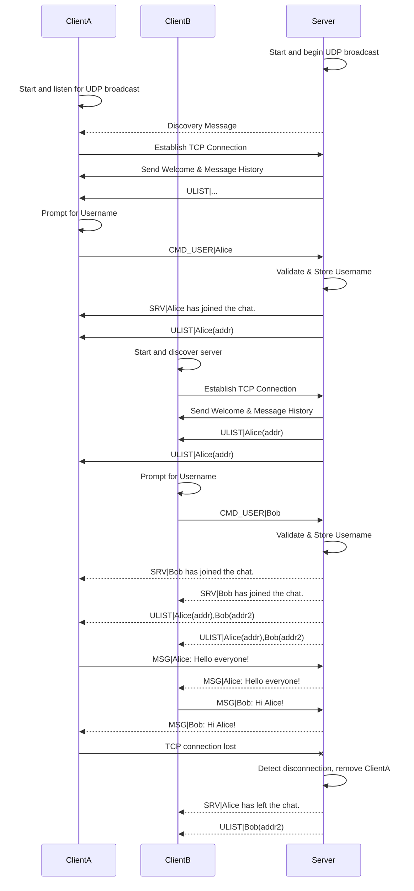

A modern, multi-threaded TCP chat application built with Python. It features a sophisticated server and an interactive, rich-text client interface powered by the `rich` library. The application supports automatic server discovery on the local network, making it easy to connect and start chatting.


## Key Features

### Server (`server.py`)
- **Multi-threaded:** Handles multiple client connections concurrently without blocking.
- **Service Discovery:** Periodically broadcasts its presence over UDP, allowing clients to find it automatically on the local network.
- **Message History:** New clients receive the last 50 messages upon joining, providing immediate context.
- **Real-time User List:** Keeps all clients synchronized with the current list of connected users.
- **Graceful Shutdown:** Handles `Ctrl+C` to cleanly disconnect all clients and shut down.
- **Thread-Safe:** Uses locks to ensure safe access to shared resources like the client list and message history.
- **Broad Compatibility:** Accepts connections from both the included rich client and basic tools like `netcat`.

### Client (`client.py`)
- **Rich TUI:** A polished and interactive Terminal User Interface built with the `rich` library.
- **Automatic Server Discovery:** Scans the local network to find and list available chat servers.
- **Dual-Panel Layout:** Simultaneously view the live chat history and the list of online users.
- **Interactive Controls:**
    - Switch between chat and user panels with the `TAB` key.
    - Scroll through chat history and the user list using arrow keys.
- **User Commands:** Change your nickname on the fly with `/nick <new_name>` or exit with `/quit`.
- **Non-blocking Input:** (Currently Windows-only) The UI remains responsive while waiting for user input.

## Requirements

The project requires Python 3.6+ and the following libraries:

- `rich`: For the beautiful and interactive client-side TUI.
- `netifaces`: For robust network interface discovery on the server to ensure broadcast messages reach all subnets.

## Installation

1.  **Clone the repository:**
    ```bash
    git clone https://your-repository-url.com/python-rich-chat.git
    cd python-rich-chat
    ```

2.  **Install the dependencies:**
    ```bash
    pip install -r requirements.txt
    # Or install them manually
    # pip install rich netifaces
    ```

## How to Use

### 1. Start the Server

First, run the server script. It will prompt you to enter a port number.

```bash
python server.py
```
You will be asked for a port to run on (e.g., `8080`). The server will then bind to all available network interfaces (`0.0.0.0`) and start listening for connections and broadcasting its presence.

### 2. Start the Client

Next, run the client script in a new terminal.

```bash
python client.py
```
The client will automatically scan the network for active servers. You can select a discovered server or choose to enter an IP address and port manually. After connecting, you will be prompted to choose a username.


### 3. Start Chatting!
- Type your message and press `Enter` to send.
- Use `/nick <new_name>` to change your display name.
- Use `TAB` to switch focus between the chat panel and the user list panel.
- Use the `Up`/`Down` arrow keys to scroll through the history of the active panel.
- Type `/quit` or press `Ctrl+C` to disconnect.

## Communication Protocol

Communication between the client and server uses a simple newline-terminated, pipe-separated (`|`) protocol.

-   `MSG|username: message`: A standard chat message from a user.
-   `SRV|text`: A notification or system message from the server (e.g., user join/leave events).
-   `ULIST|user1(addr1),user2(addr2)`: A comma-separated list of all connected users and their addresses.
-   `CMD_USER|new_username`: A command from a client to change their username.

This simple protocol allows clients to parse incoming data easily and determines how it should be displayed. Basic clients that don't use this protocol (like `netcat`) can still send and receive messages, which are handled as raw text by the server.

## Server and Client Sequence Diagram

The following diagram illustrates the typical flow of events between the server and multiple clients, from initial connection to message exchange and disconnection.



## Limitations and Future Work

-   **Platform Support:** The rich client's interactive UI currently relies on `msvcrt` and is **Windows-only**. Support for Linux and macOS would require implementing non-blocking input using `termios` and `tty`.
-   **Private Messaging:** Implement a `/msg <user> <message>` command for one-on-one conversations.
-   **Channels/Rooms:** Add the ability for users to create and join different chat rooms.
-   **Encryption:** Secure the communication channel using SSL/TLS.
-   **File Sharing:** Allow users to send and receive files.

## License

This project is licensed under the MIT License. See the [LICENSE](LICENSE.md) file for details.